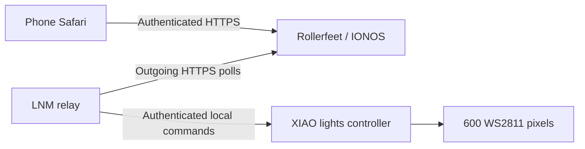

# Web controls

Firmware: **3.0.0-web.2**. The web page is a single self-contained HTML file in `web/index.html`, embedded in the XIAO by `python3 tools/embed_web.py`. Its layout adapts to phones and larger screens and uses no third-party scripts or fonts.

Choose any of the five completed animations, next animation, lights on/off, brightness 0–100%, automatic cycling, preview/all playlist, and 10–600 seconds per animation. Picking an animation holds it until you change it or enable cycling. Changing the playlist starts cycling that list. Preview always contains Meteor Rain and Witchfire Sparkles, including in a production build. Production still defaults to all five at 180 seconds each; development defaults to preview at 30 seconds. Settings are held in memory and reset after a restart.

Brightness is relative to the existing output limit of 200 and is applied separately from the renderer's brightness. LED #1's diagnostic overlay retains priority, even while lights are off. The 600-pixel length, fixed 1250 ms meteor launches, and disabled blackout mask are unchanged. Wi-Fi retry and authenticated ArduinoOTA remain available.

## Home and away

At home, open the controller's address in Safari. Its `/` page uses the existing private OTA password with username `admin`. The `/status` endpoint remains read-only and public within the LAN. `/api/state` and POST `/api/control` require authentication. Controls are validated before mutation; requests need a custom header and same-origin checks, and there is no CORS grant. Direct controller HTTP is intended for the trusted home LAN.

For outside access, open **https://rollerfeet.com/lights/**. It uses a separate web password; the app supplies the `admin` username. The password stays only in the open page's memory. Disconnect or closing/reloading the page requires another login. Save the web password in your password manager. The private access note is kept separately from this repository.

LNM polls the website and controller every two seconds. The page refreshes every three seconds, so confirmation can take a few seconds. No incoming home port, home IP, or DDNS address is placed in the website. This is animation/display control, not mains-switch control or remote firmware upload. LNM, home internet, and the controller's Wi-Fi must all be available. Animations continue locally when any relay connection is unavailable.

The relay marks controller status stale after 15 seconds and rejects new commands when offline or updating. One command can be pending at a time. Commands expire after 15 seconds. A queued command is claimed exactly once; an ambiguous result is shown as unconfirmed rather than retried, preventing a repeated "next" command. The next heartbeat reports both actual controller state and acknowledgement. If a response is lost, inspect the current animation before trying again. This is deliberately not a guarantee of automatic rollback.

## Deployment

1. Run `tools/embed_web.py` after editing the page, then compile and upload the Arduino sketch using the established private-password OTA helper. Verify `/status` reports web.2.
2. Publish `web/index.html` as `lights/index.html`, plus `remote/api.php` and `remote/.htaccess` to the isolated `lights/` directory on IONOS. This leaves the homepage untouched. Use the domain's configured modern PHP runtime, not the server's default CLI PHP.
3. Create `lights/private/.htaccess` from `remote/private.htaccess`. Provision a private `config.php` returning `password_hash` (PHP password_hash output) and a random `bridge_token`. Verify public requests to `private/config.php` and `private/state.json` receive HTTP 403 before enabling the relay. Runtime state is created with private file permissions.
4. On LNM, install `remote/bridge.py` at `~/.local/share/holiday-lights/bridge.py` and the unit file at `~/.config/systemd/user/holiday-lights-bridge.service`. Provision mode-600 `~/.config/holiday-lights/bridge-config.json` with `relay_url`, `bridge_token`, `controller_url`, and `controller_password`. The relay URL must use HTTPS on rollerfeet.com. Credentials are never command-line arguments or logs.
5. Enable the user service and user lingering so it starts after reboot without requiring desktop login. Check service logs for connected/unavailable status. Rotate the private web password hash and bridge token if access needs revocation.
6. Verify website authentication, private-directory denial, bridge authentication, real state, and command acknowledgement. Never put synthetic controller state into the live website for testing.

Use source-only Git/Drive retention. Private credentials, web runtime state, firmware binaries, and deployment staging files are excluded. The bridge uses Python's standard library, has no inbound listener, and needs no OpenAI resources during ordinary use.

## Validation and current limits

Firmware tests cover bounded commands, manual hold, both playlists, duration, immediate output changes, status-pixel priority, and OTA rejection. Run the existing host tests and production playlist check as described in README. `python3 tests/relay_test.py` on a host with modern PHP tests the real relay for authentication, offline/update protection, bounds, cross-origin rejection, single claims, expiry, acknowledgements, and state filtering. `node tests/web_control_test.js` checks login, control updates, remote acknowledgements, offline/reconnect behavior, hidden-tab polling, and logout without accessing a browser. The website JavaScript also passes syntax checking.

The web.2 build uses 1,106,583 bytes program storage and 58,332 bytes global RAM and passes for XIAO ESP32S3 with esp32 core 3.3.12 and FastLED 3.10.5. IONOS HTTPS, authentication, and private-storage denial and LNM's authenticated outgoing connection have been verified. On October 6 the controller was unreachable. On October 7 web.2 was uploaded wirelessly, its restarted version verified, and the IONOS→LNM→controller command path verified using the existing brightness value. This confirms software acknowledgement, not a user-observed visual effect. Browser visual QA was blocked by the browser administrator policy. Phone appearance and live control need user review.
